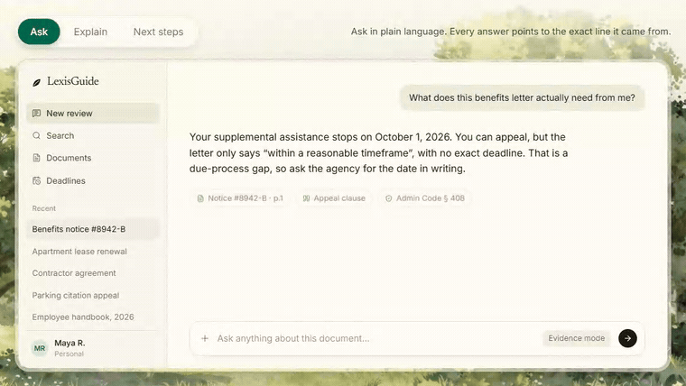
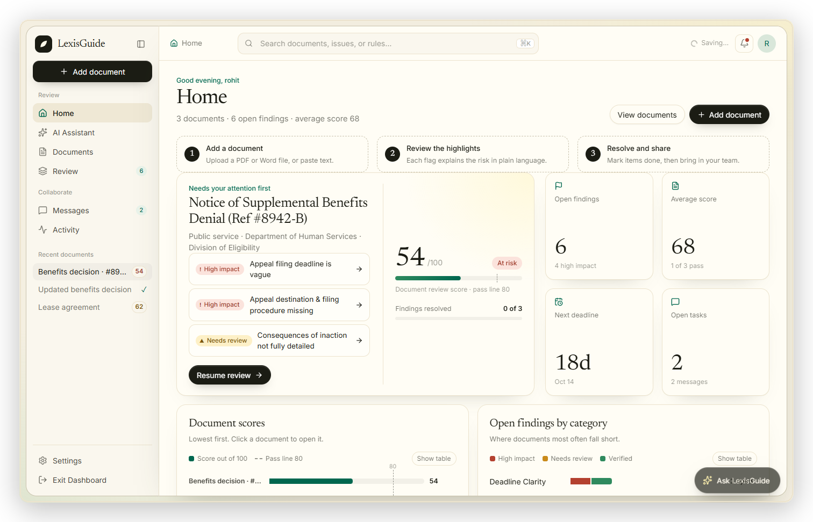
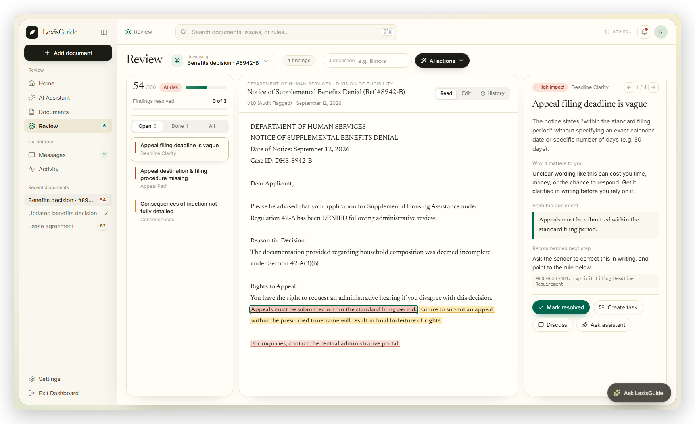
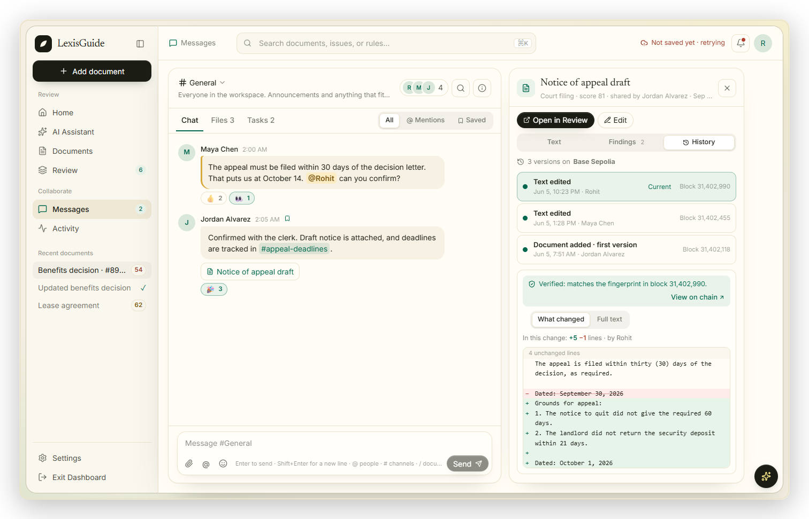
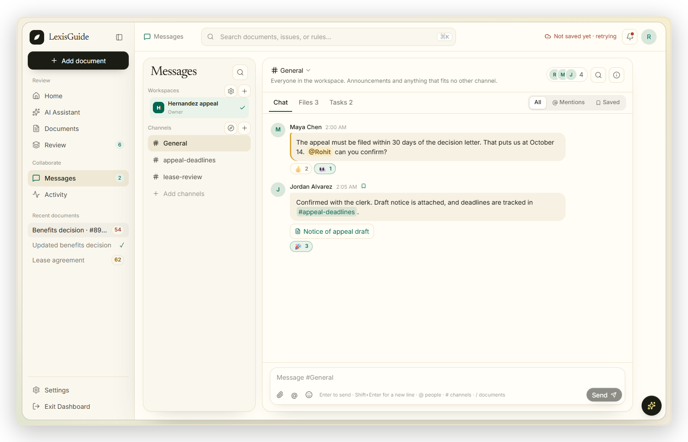
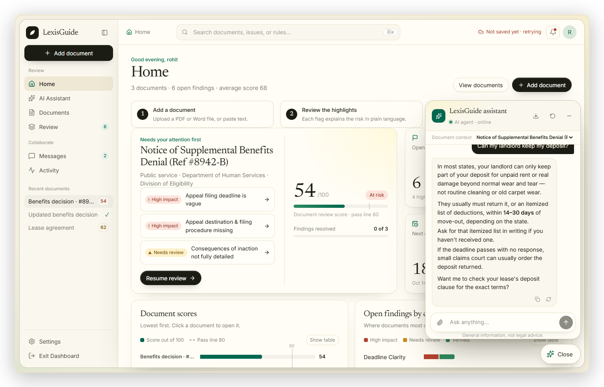
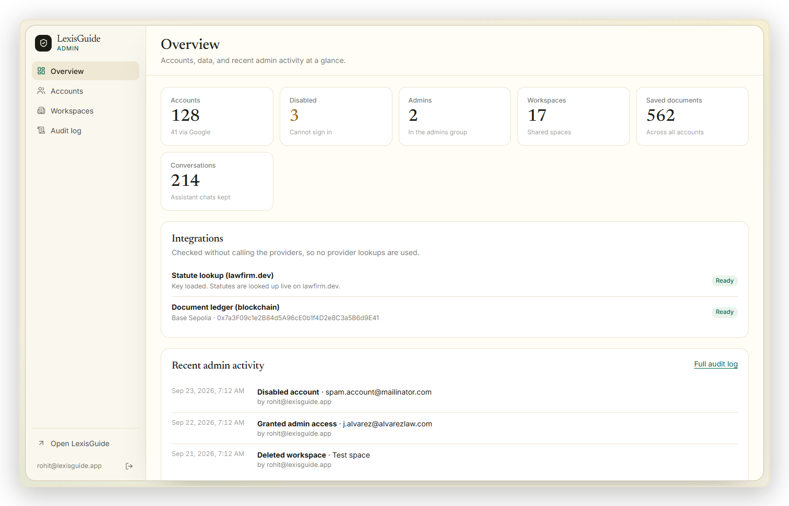
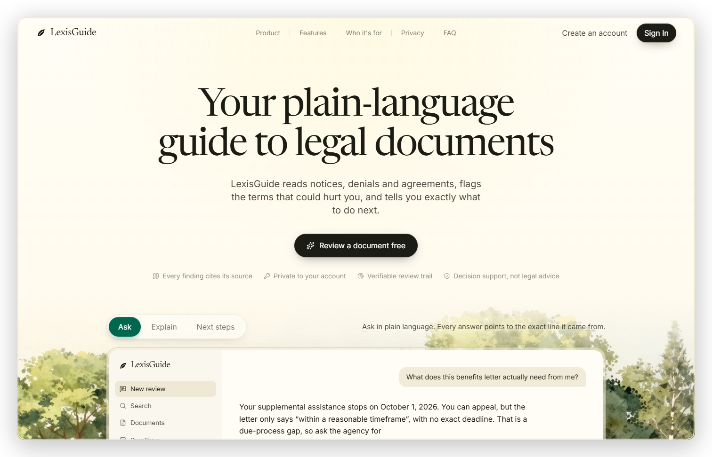
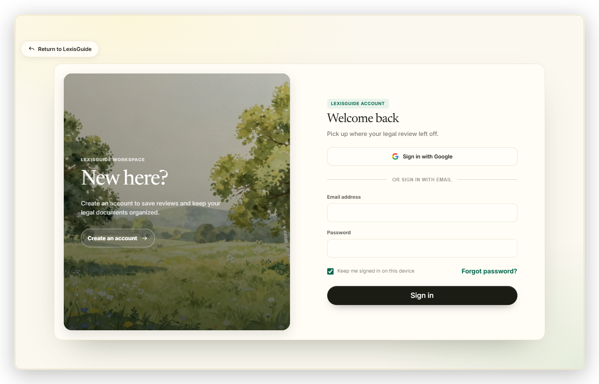
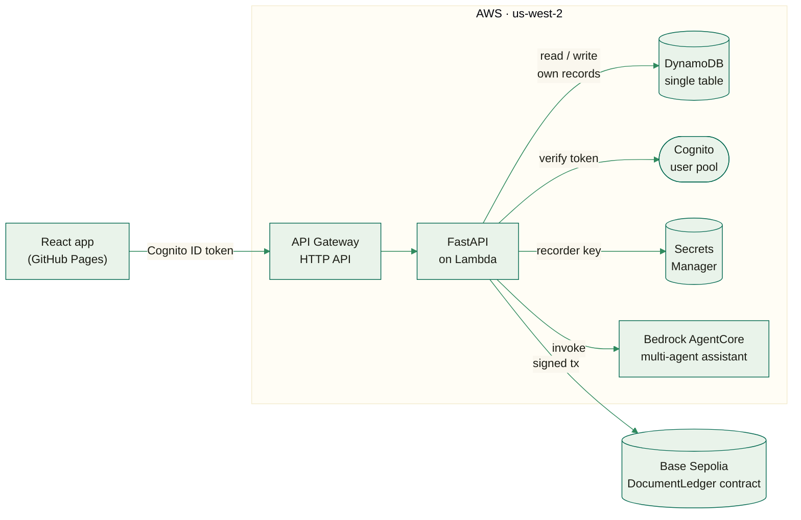

<div align="center">


# LexisGuide

<picture>
  <source media="(prefers-color-scheme: dark)" srcset="https://readme-typing-svg.demolab.com?font=Georgia&size=22&pause=1400&color=5CC79F&center=true&vCenter=true&width=700&height=50&lines=Understand+any+legal+document+in+seconds.;Every+edit%2C+verified+on+the+blockchain.;A+team+of+AI+agents+that+know+the+law.;Built+for+LexHack+2026." />
  
</picture>

An AI legal co-pilot that reads leases, benefits denials and government notices,
flags what's risky in plain English, and gives every edit a verified history on the blockchain.
Built for **LexHack 2026** — decision support, not legal advice.

[](LICENSE)
[](../../actions/workflows/ci.yml)
[](../../actions/workflows/codeql.yml)
[](../../actions/workflows/deploy-api.yml)
[](../../actions/workflows/pages.yml)
[](https://k1lst1x.github.io/LexisGuide/)

<p>
  
  
  
  
  
  
  
  
  
  
  
  
</p>

[**Live app**](https://k1lst1x.github.io/LexisGuide/) · [**Admin portal**](https://k1lst1x.github.io/LexisGuide/admin) · [**Report a bug**](../../issues)

</div>

<p align="center">
  <a href="#what-lexisguide-does"></a>
  <a href="#see-it-in-action"></a>
  <a href="#how-its-built"></a>
  <a href="#getting-started"></a>
  <a href="#deploying-to-aws"></a>
  <a href="#testing"></a>
</p>

<p align="center">
  
  <br>
  <sub>The landing page's own live demo — ask a question, see the exact clause it's grounded in, get a dated plan. Not a mockup.</sub>
</p>

<br>

## What LexisGuide does

Every year, people get letters they can't afford a lawyer to explain: a benefits
denial, an eviction notice, a lease renewal. Miss one deadline buried in the
fine print, and the case can be lost by default.

**LexisGuide reads the document for you.** Add a PDF, Word file, or pasted text
and it scores the document for clarity and fairness, flags every clause worth
worrying about, explains it in plain English with the exact evidence, and
suggests what to do next — then keeps a verified, block-by-block history of
every edit, so nothing can be quietly rewritten later.

|  |  |
|---|---|
| **📄 AI document review** | A 0–100 clarity & fairness score, evidence-backed findings, and AI-drafted rewrites scoped to one clause at a time. |
| **⛓️ Blockchain-verified history** | Every change is fingerprinted (SHA-256) and written to the Base blockchain. Open any past version and check it against its own block. |
| **🤖 A multi-agent AI assistant** | A router plus specialist agents — support, US law, document review, and an operator that can apply an approved fix — running on AWS Bedrock. |
| **💬 Slack-style workspaces** | Channels, @mentions, reactions, and shared documents, so a tenant, a caseworker, and a legal-aid volunteer can work the same case together. |
| **🔐 Admin portal** | Account management, an audit log, and integration health, gated behind a Cognito admins group. |
| **🛡️ Secure by design** | Every record is checked against the signed-in Cognito identity server-side; the browser never holds AWS credentials. |

This is decision support, not legal advice — LexisGuide points people to what
to check and who to ask, it does not replace a lawyer for a high-stakes decision.

<p align="center">
  
  <br>
  <sub>Every color in this README is the app's own — paper, ink and meadow green, pulled straight from its CSS.</sub>
</p>

<br>

## See it in action

<table>
<tr>
<td width="50%">

**Home** — every document's score, its open findings, and what to work on first.



</td>
<td width="50%">

**Review** — the findings queue, the document, and the evidence, side by side.



</td>
</tr>
<tr>
<td width="50%">

**Verified history** — every version checked against the block that recorded it.



</td>
<td width="50%">

**Messages** — Slack-style channels, mentions, reactions, and shared documents.



</td>
</tr>
<tr>
<td width="50%">

**AI Assistant** — plain-English answers on US law, grounded and cited.



</td>
<td width="50%">

**Admin portal** — accounts, workspaces, integrations, and the audit log.



</td>
</tr>
<tr>
<td width="50%">

**Landing page** — the full pitch, watercolor meadow and all.



</td>
<td width="50%">

**Sign-in** — email and password, or one tap with Google.



</td>
</tr>
</table>

<br>

## How it's built

The browser never holds an AWS credential. Every request carries the signer's
Cognito ID token, and the API checks it — and the caller's own records — before
touching DynamoDB, Bedrock, or the ledger's signing key.



- **Frontend** — a React SPA on GitHub Pages calls the API directly; it holds no secrets.
- **API** — FastAPI on Lambda behind API Gateway; every route depends on a verified Cognito identity.
- **Data** — one DynamoDB table, partitioned per user and per workspace, so a query can only ever reach its owner's rows.
- **AI** — a router plus specialist agents (support, US law, document review, drafting, an inbox summarizer, and an operator that runs approved actions) on AWS Bedrock, with deterministic fallbacks if a call fails.
- **Ledger** — a `DocumentLedger` Solidity contract on Base Sepolia. The API signs with a key held in Secrets Manager; the browser only ever sees a fingerprint.

<br>

## Tech stack

| Layer | Technology |
|---|---|
| **Frontend** | React 19 · TypeScript · Vite 8 · Tailwind |
| **Backend** | Python 3.12 · FastAPI · Pydantic v2 · Uvicorn on AWS Lambda |
| **Data** | Amazon DynamoDB (single-table design) |
| **Auth** | Amazon Cognito — email/password and Google sign-in |
| **AI** | Amazon Bedrock (Nova models) via a Bedrock AgentCore multi-agent runtime |
| **Blockchain** | Solidity `DocumentLedger` contract on Base Sepolia, via `web3.py` |
| **Infra & CI** | Terraform · GitHub Actions · GitHub Pages · CodeQL · Dependabot |

<br>

## Repository layout

```text
frontend/                  React web app, deployed to GitHub Pages
backend/                   FastAPI service and tests, packaged for AWS Lambda
agentcore/assistant/       AgentCore runtime for the multi-agent chat assistant
agentcore/runtime/         AgentCore runtime for one-shot document review
packages/assistant_agent/  The agent team: router, specialists, tools, prompts
packages/review_contract/  Shared review request/result models and prompt
infra/                     Terraform for Cognito, DynamoDB, Lambda, API Gateway
blockchain/                DocumentLedger contract: every edit recorded on Base
```

<br>

## Getting started

Requires **Python 3.12** and **Node.js 22.22.2+**.

**1. Start the API**

```bash
cd backend
python3.12 -m venv .venv && source .venv/bin/activate
pip install -e ../packages/review_contract -e ../packages/assistant_agent -e '.[dev]'
uvicorn app.main:app --reload --port 8000
```

API docs: [http://localhost:8000/docs](http://localhost:8000/docs).

**2. Start the web app**

```bash
cd frontend
npm install
npm run dev
```

The Vite dev server proxies `/api` to `localhost:8000`. To point it at a
deployed API instead, set `VITE_API_BASE_URL` — see `frontend/.env.example`.

Without any cloud credentials configured, the app still runs: document review
falls back to a local rule-based scan, and features that need the API report
themselves as unavailable rather than fabricating a result.

<br>

## Deploying to AWS

LexisGuide runs on Cognito, DynamoDB, Lambda, API Gateway and Bedrock
AgentCore, deployed with Terraform and GitHub Actions. GitHub Pages hosts only
the compiled React app; it calls the API over HTTPS and never receives an AWS
credential.

Full one-time setup — Cognito, Google sign-in, the AgentCore runtimes, and
adding the first admin — is in **[AWS_AUTH_SETUP.md](AWS_AUTH_SETUP.md)**.

Two integrations are optional and off unless configured:

- **Statute lookups** — set `lawfirm_api_key_secret_arn` in Terraform to a
  Secrets Manager ARN holding a lawfirm.dev key. Without it, statute lookups
  are simply unavailable.
- **Document ledger** — set the deployed `DocumentLedger` contract address and
  an RPC URL to turn on blockchain history. Without it, the History tab says so
  plainly instead of pretending to record anything.

Admins are managed at **`/admin`**, gated by Cognito's `admins` group — see
[Admin portal](AWS_AUTH_SETUP.md#admin-portal) to add the first one.

<br>

## API surface

All routes except `/health` require a Cognito ID token; the API only ever
reads or writes the caller's own records.

| Route group | What it does |
|---|---|
| `POST /api/v1/analyze` | Reviews a document and returns evidence-backed findings. |
| `POST /api/v1/chat` | Talks to the multi-agent assistant; carries workspace context and proposed actions. |
| `GET/POST /api/v1/workspaces/**` | Workspaces, channels, messages, reactions, and shared documents. |
| `GET/POST /api/v1/ledger/**` | Records and reads a document's blockchain-verified history. |
| `GET /api/v1/statutes/lookup` | A point-in-time statute lookup, with full provider provenance. |
| `GET/POST /api/v1/admin/**` | Account, workspace, and audit-log management for admins. |

<br>

## Testing

```bash
cd backend && pytest                                   # FastAPI routes and storage
cd packages/assistant_agent && pytest                  # the router and every specialist agent
cd frontend && npm test                                # React components and hooks
```

The suite runs against real infrastructure standing in for AWS, not mocks of
our own code: **moto** provides an in-memory DynamoDB, and an **in-memory EVM**
(`eth-tester`) runs the actual compiled `DocumentLedger` bytecode, so the
blockchain tests exercise the real contract — including a tampered version
being correctly rejected.

<br>

## Security

The browser never receives an AWS credential; every DynamoDB record is scoped
to its owner and checked server-side on every request; uploaded files are
parsed for text only, never executed; and only a document's SHA-256
fingerprint — never its text — is ever written on-chain. See
**[SECURITY.md](SECURITY.md)** to report a vulnerability.

<br>

## License

[MIT](LICENSE).

<br>

<div align="center">

Built for **LexHack 2026**.


<sub><a href="#lexisguide">Back to top ↑</a></sub>

</div>
